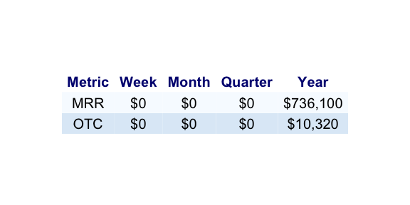
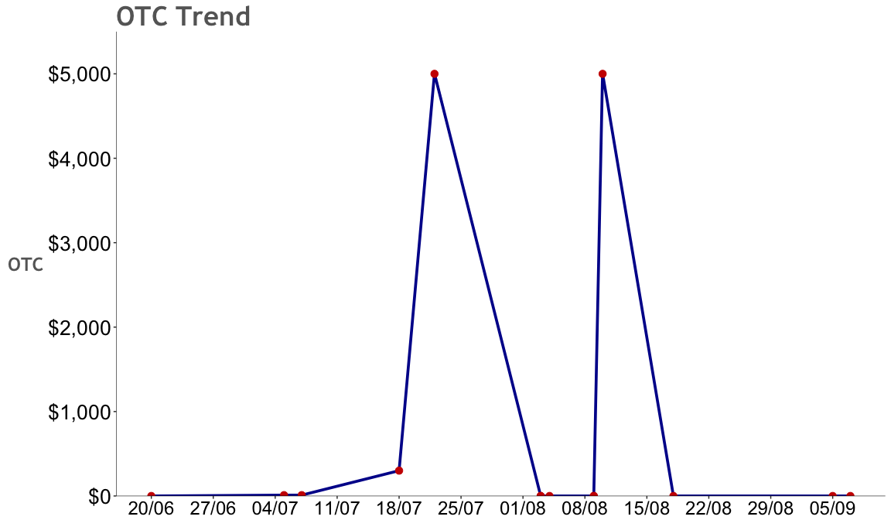
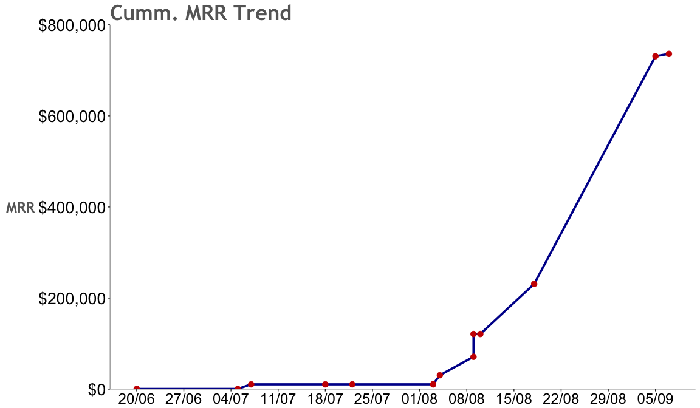
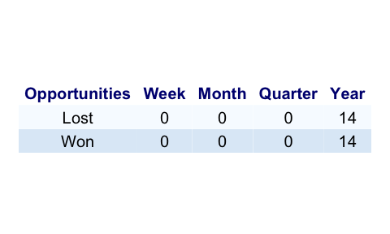
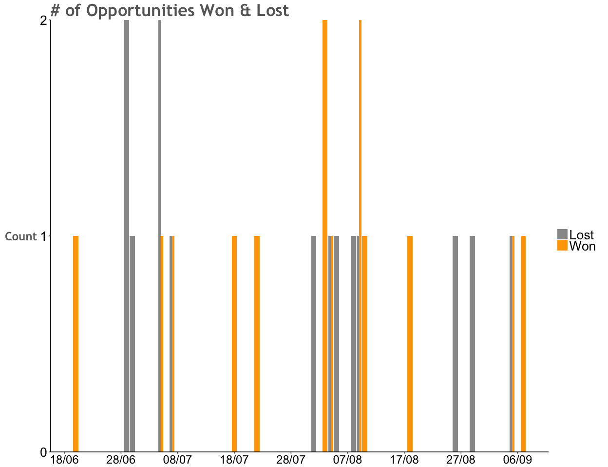
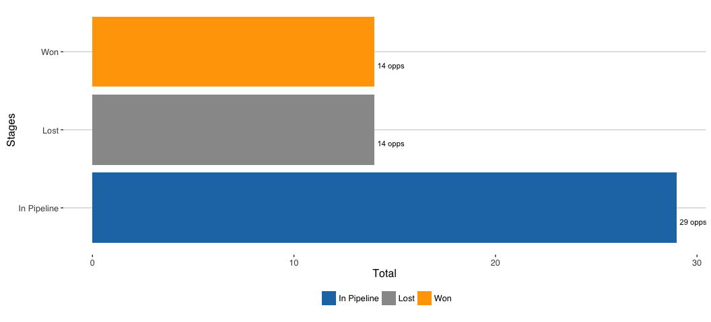
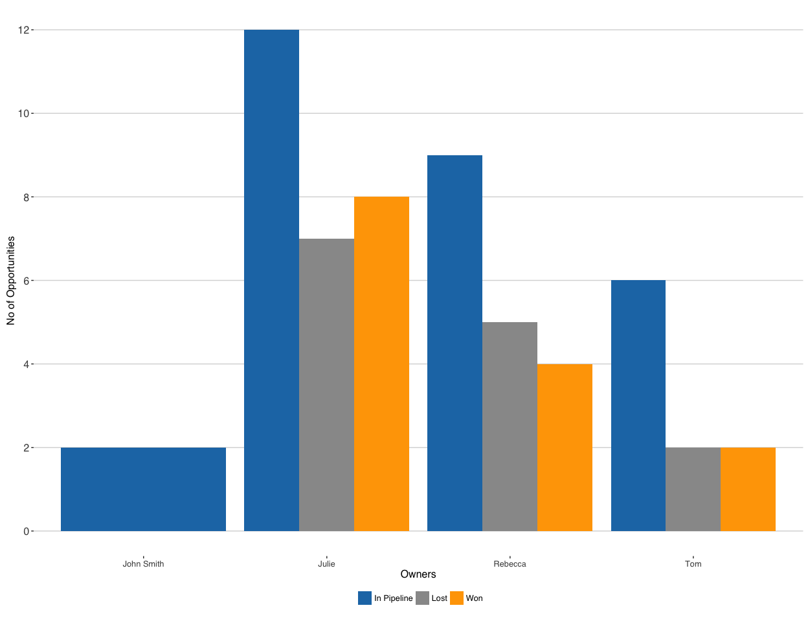
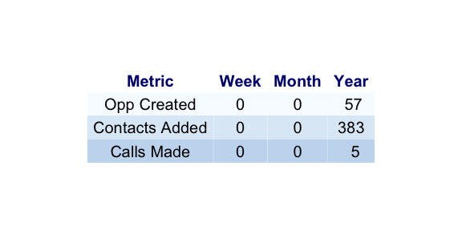

Sales Report
================
7th October

Sections
========

This is the weekly sales report for ABC Company and it presents an overview of the overall sales performance. The report is split across four categories:

1.  Results Analysis ($) - Analysis of sales by $ amount comparing to budget and showcasing trends
2.  Results Analysis (\#) - Analysis of sales by number of opportunities and showcasing trends
3.  Activity Analysis - This section provides an overview of the activity levels at the client
4.  Insights - Deeper analysis of the sales data including ratios

Section 1 : Result Analysis($)
==============================

 

Section 2 :Result Analysis(\#)
==============================

There are 57 opportunities
==========================

-   **14** are WON with total MRR **$736,100**
-   **14** are LOST with total MRR **$3,265,550**
-   **29** are in the pipeline with total MRR **$3,207,500**

Opportunities Count
===================

Opportunity stages by owners
============================

Section 3 Activity Analysis
===========================

Section 4 : Insights
====================

-   Conversion Rate
-   Definition: \# opportunities won / Total \# of opportunities

-   Conversion Rate is `14` / `57` = `24.56`%

-   Sales Velocity

-   Definition: Average number of days for an opportunity to transition from Created to WON

-   Sales Velocity is `14.64` days

<!-- Data Quality of 383 Contacts -->
